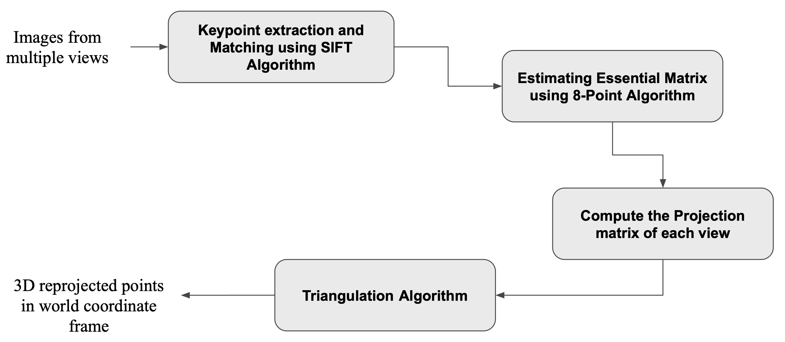

# 3D-Structure-Reconstruction
## <a href = "https://www.youtube.com/watch?v=asmdsp42GHo">Link</a> for the demo.
## Pipeline

## Motivation
* 3D scene representation is a challenging and ongoing research area in
computer vision, with numerous techniques proposed, from traditional image
processing to advanced methods like deep neural networks and transformer
models.

* This work employs traditional image processing techniques and Incremental
Structure from Motion (SfM) algorithm for 3D reconstruction to create 3D point
clouds of objects.

* 3D reconstruction from multiple photographs is crucial for applications like
autonomous driving and augmented reality; however, specialized sensors like
LIDAR can be expensive and complicated to use.

* Advances in digital cameras, improved resolution, and clarity have enabled
new, more affordable 3D reconstruction techniques using only RGB cameras,
without the need for expensive sensors.

* Structure from Motion (SfM) reconstructs 3D structures from multiple
photographs taken from different viewpoints, with the main challenges being
resilience, precision, completeness, and scalability; an incremental approach is
used to address these issues.

## Problem Statement
* Structure from Motion (SfM) reconstructs 3D structures from multiple
photographs taken from different viewpoints.

* This work employs traditional image processing techniques and Incremental
Structure from Motion (SfM) algorithm for 3D reconstruction to create 3D point
clouds of objects.

* The proposed method is evaluated using specific 3D reconstruction datasets
to assess its performance.

## How to run?? 
```
  1. Create the conda environment on your system using the 'environment.yml' file using the following command:
     'conda env create -f environment.yml'.
  2. Make a folder with the name of structure to be reconstructed(eg: tower) in the 'Datasets' directory.
  3. In this folder, add the images of the 3D stucture such that all the images are in an iterative manner 
     as if the camera is moving around the structure in 360 degree with each pair of consecutive images sharing 
     some key points. All images should be captured by the same camera.
  3. Now, add the intrinsic camera matrix of your calibrated camera in a txt file named 'K.txt' and place it in 
     the same stucture named folder(eg: tower) along with the images.
  4. Finally, activate the conda environment and run the command 'python main.py folder_name'. Here, we are 
     passing the name of our structure folder(eg: tower) as the command line input. So, in our example case 
     the command would look like 'python main.py tower'.
  5. The reconstructed 3D structure would be saved in a .ply file named 'reconstruction.py'. This file would be
     saved in a folder in the 'res' directory named same as the input structure(eg: tower). This folder will 
     also contain the reconstruction error plot(plot.png) and the pose array in the file 'pose_array.csv'.
```


